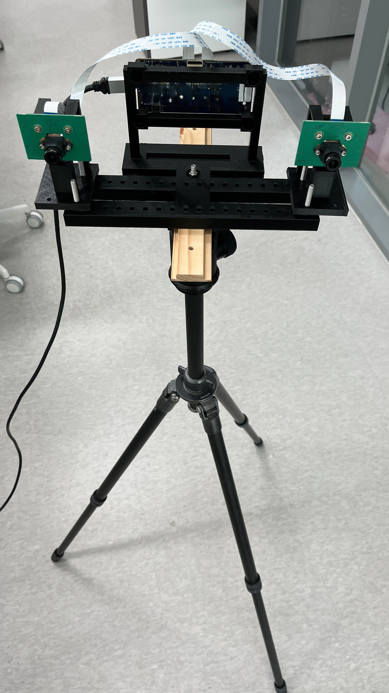
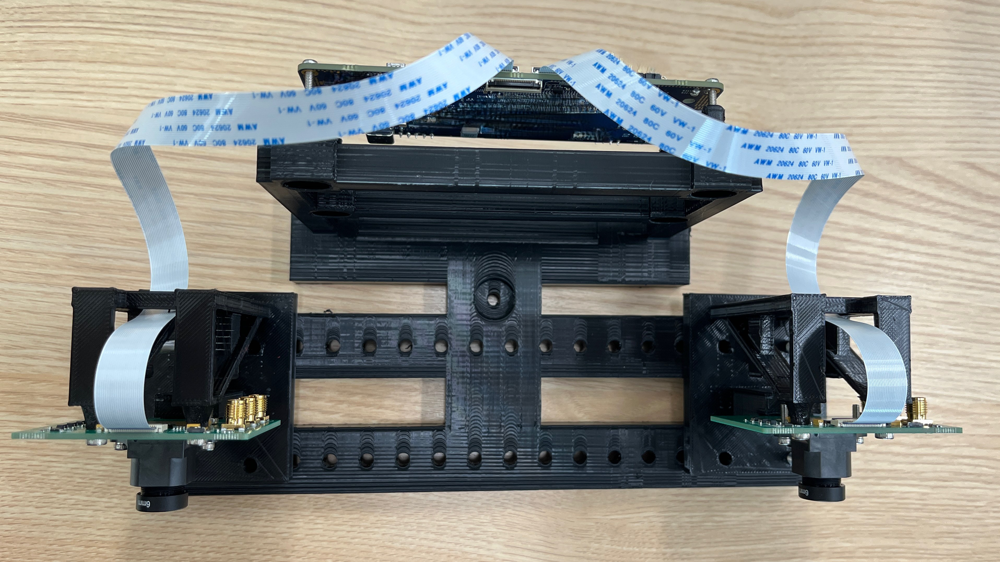
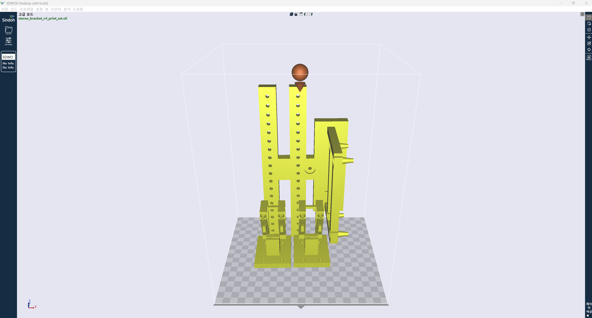

# PCB 모듈 브라켓 설계와 3D 프린팅 가이드

이 글은 원하는 이벤트 카메라 모듈과 FPGA 보드를 안정적으로 고정할 수 있는 출력물을 직접 설계하고 3D 프린터로 만들면서 남긴 기록입니다. 실제 조립에 필요한 치수, 나사와 케이블 공간, 슬라이서 설정, 출력 뒤 확인한 내용을 순서대로 정리했습니다.

  

처음부터 큰 브라켓을 한 번에 출력하기보다, 실제 PCB와 나사·케이블을 기준으로 더미 모델을 만들고 작은 체결 시험편을 먼저 출력했습니다. 이 순서가 맞아야 전체 출력에서 구멍, 레일, 케이블 공간 때문에 다시 만드는 일을 줄일 수 있었습니다.

## 1. 준비물과 기록할 것

### 준비물

- 고정하려는 실제 PCB와 연결 케이블
- PCB에 맞는 나사와 너트
- 캘리퍼스 또는 정밀 자
- 3D 프린터와 필라멘트
- 작은 나사 구멍 시험편을 출력할 재료

회사에 보관된 나사 묶음은 실제 카메라 모듈과 FPGA 보드를 들고 가서 비교하는 것이 가장 안전하다. 나사산, 머리 형상, 실제 길이는 사진이나 규격명만으로 오차가 생기기 쉽다. 맞는 나사를 찾으면 직경과 필요한 체결 길이를 함께 기록해 둔다.

### CAD에 넣기 전에 측정할 치수

보드의 가로·세로만 재면 충분하지 않다. 아래 값이 브라켓 설계의 기준이 된다.

| 확인할 항목 | 왜 필요한가 |
| --- | --- |
| PCB 외곽 크기와 두께 | 레일 폭, 끼움 높이, 보드 외곽 간섭을 정한다. |
| 나사 구멍의 중심 좌표와 직경 | 고정 보스와 체결 구멍의 정확한 기준이다. 원의 바깥쪽 거리만 재면 안 되고 중심 간격으로 바꿔야 한다. |
| 렌즈 중심 또는 기준축 위치 | 스테레오 baseline, 촬영 방향, 다른 부품과의 높이 관계를 맞춘다. |
| 커넥터·USB·FFC의 위치와 높이 | 브라켓이 포트와 케이블을 막지 않도록 한다. |
| 케이블의 실제 굽힘 방향과 필요한 공간 | 커넥터 바로 앞뿐 아니라 케이블이 빠져나가는 방향 전체를 비워야 한다. |
| 나사 머리·너트의 크기와 체결 방향 | 뒤쪽 너트 공간, 드라이버 접근, 자리파기 필요 여부를 판단한다. |
| 프린터 공차 | CAD 구멍과 실제 출력 구멍은 다르므로 체결 시험값이 필요하다. |

나사 구멍 간격을 측정할 때는 가능한 한 중심 간격을 직접 측정한다. 외곽 간격만 측정했다면 `중심 간격 = 외곽 간격 + 구멍 지름`으로 환산한다.

## 2. 사용하는 프로그램과 역할

### FreeCAD

FreeCAD는 mm 단위의 정확한 3D 형상, 구멍, 레일, 리브를 만들고 수정하기에 적합하다. 특히 PCB 브라켓은 구멍 위치나 보드 두께가 조금만 바뀌어도 형상을 다시 맞춰야 하므로, 치수를 파라미터로 관리하는 방식이 유리하다.

권장 사용 순서는 다음과 같다.

1. 실제 보드의 단순 더미 모델을 만든다.
2. 나사 구멍 중심, 커넥터, 케이블 공간을 기준점으로 둔다.
3. 더미 모델을 기준으로 고정대 형상을 만든다.
4. 조립 상태에서 간섭과 체결 방향을 확인한다.
5. 필요한 부품만 STL로 내보낸다.

FreeCAD Python은 반복되는 보스, 구멍 grid, 레일, 여러 baseline 위치처럼 규칙적인 형상을 자동으로 만들 때 좋다. 치수 값을 스크립트 상단에 모아 두면 다음 프로젝트에서 보드만 바꾸어 다시 쓸 수 있다.

### 3DWOX Desktop / 3DWOX Slicer

이 프로그램은 STL을 3DWOX 2X가 이해하는 G-code로 바꾸는 슬라이서다. 출력 방향, 레이어 두께, 서포트, 필라멘트 온도, 인필을 설정하고 레이어 미리보기로 실제 출력 경로를 확인한다.

STL은 형상 파일일 뿐 프린터 동작 조건이 들어 있지 않다. 프린터에 넣을 파일은 같은 프린터와 재료 프로파일로 슬라이스한 G-code를 쓰는 것이 안전하다. G-code는 프린터와 프로파일 의존성이 있으므로 다른 제조사 프린터에 그대로 쓰지 않는다.

### 3D 뷰와 렌더 확인

FreeCAD의 조립 뷰 또는 STL의 정면·측면·상면·축측 뷰를 반드시 확인한다. 특히 아래 항목은 정면만 보면 놓치기 쉽다.

- 나사 구멍이 보스나 리브에 막혔는지
- 너트를 끼울 뒤쪽 공간이 있는지
- 보드가 레일 위에 실제로 닿는지
- 케이블 출구가 브라켓과 겹치지 않는지
- 길게 뻗은 지지대가 공중에 떠 있지 않은지
- 출력 방향에서 지붕 아래나 보스 아래에 서포트가 필요한지

## 3. 실제 부품을 단순 3D 모델로 만드는 방법

처음부터 부품의 실물 외관을 전부 모델링할 필요는 없다. 고정 구조에 영향을 주는 요소만 정확하면 충분하다.

- PCB: 외곽 사각형과 실제 두께
- 나사 구멍: 중심 위치와 관통 구멍
- 렌즈: 중심축을 확인할 수 있는 원통
- 커넥터: 가장 튀어나온 높이와 폭을 가진 단순 박스
- USB·전원 포트: 플러그가 들어가는 방향을 포함한 단순 박스
- FFC 케이블: 커넥터에서 시작해 실제로 꺾이는 방향을 포함한 여유 공간 형상

케이블은 선 한 가닥으로만 생각하면 안 된다. FFC는 폭과 굽힘 반지름을 가진 띠로, USB와 전원 케이블은 커넥터보다 큰 플러그와 굽힘 공간을 가진 부피로 잡는다. 이를 `keepout` 형상으로 두면 브라켓을 만들 때 충돌 여부를 눈으로 확인할 수 있다.

스테레오 이벤트 카메라처럼 기준축이 있는 부품은 렌즈 중심을 별도 기준점으로 둔다. 보드 외곽이 아니라 렌즈 중심 사이 거리가 baseline이므로, 카메라가 옮겨져도 그 기준으로 거리와 수평을 확인할 수 있다.

## 4. 브라켓 형상 설계 원칙

### 접촉하는 곳만 잡기

PCB 전체를 큰 판으로 덮으면 재료와 시간이 많이 들고, 포트와 케이블도 막기 쉽다. 보통 아래 조합이 더 좋다.

- PCB 아래를 받는 하단 레일 또는 홈
- 나사 구멍을 잡는 보스 2개 또는 4개
- 긴 구조를 지지하는 얇은 리브
- 필요한 위치의 너트 공간과 드라이버 접근 공간

이번 카메라 홀더도 하단 레일과 두 개의 나사 보스로 보드를 기준 위치에 잡고, 뒤쪽은 필요한 리브만 두는 모듈형 구조로 만들었다. 보드마다 홀더만 교체하고 베이스는 재사용할 수 있다는 점이 큰 장점이다.

### 레일과 기준면

보드를 레일에 얹는 구조에서는 레일 바닥을 조립 기준면으로 정한다. 예를 들어 카메라 PCB의 바닥이 홈 바닥에 닿는다면, 모든 나사 구멍 높이와 렌즈 높이는 그 바닥에서 계산해야 한다. 이 기준이 틀리면 구멍 간격은 맞아도 보드가 뜨거나 나사가 비스듬하게 들어간다.

레일은 너무 깊으면 보드를 끼우고 빼기 어렵고, 너무 얕으면 흔들린다. 이번 카메라 홀더는 하단 레일 깊이 5 mm를 사용했다. 다만 다른 PCB에서는 보드 두께, 삽입 방향, 케이블 방향을 보고 다시 정한다.

### 나사 보스와 고깔형 접촉부

PCB 나사 구멍을 잡는 접촉부는 단순 원통보다 앞은 얇고 뒤는 넓어지는 고깔형 보스가 좋다.

- PCB에 닿는 앞쪽: 나사 구멍 주변만 얇게 잡아 부품과 간섭을 줄인다.
- 뒤쪽: 원통 또는 테이퍼를 넓혀 힘을 분산한다.
- 보스 중심: 나사가 완전히 관통할 수 있어야 한다.
- 뒤쪽: 너트를 넣을 공간과 드라이버가 접근할 공간을 비운다.

보스의 바깥 두께는 앞쪽에서 얇아도 되지만, 길게 튀어나온 부분 전체를 얇게 만들면 쉽게 휜다. 앞쪽 접촉 ring은 필요한 최소 두께로 두고, 보드 뒤쪽으로 갈수록 넓혀 리브나 지지판에 연결한다. 나사 구멍 뒤쪽에는 상관없는 기둥이 관통하지 않도록 한다.

### 리브와 두께

이번 출력 세트는 작은 시험편이 아니라 조립용 브라켓 전체를 담은 STL이다. STL 기준으로 베이스는 약 **109.86 × 126 × 252 mm**, 카메라 홀더 두 개는 각각 약 **68 × 54 × 78.08 mm** 크기다. 따라서 일반적인 얇은 벽 두께 수치를 그대로 적용하기보다, 실제 STL처럼 레일·보스·리브를 조합해 필요한 곳만 지지하는 방식으로 설계하는 편이 맞다. 큰 판을 통째로 두껍게 하는 대신 다음처럼 보강하면 재료를 줄이면서도 구조를 유지할 수 있다.

- 길게 떠 있는 판 아래에 삼각 리브를 추가한다.
- 보스 뒤쪽을 리브나 짧은 수평 연결대로 받친다.
- 양끝 지지대는 바닥과 수평 또는 사선으로 연결한다.
- 기둥 사이에는 필요하면 얇은 가로 연결대를 둔다.

리브는 나사 구멍과 너트, 케이블 통로를 막지 않는 위치에 둬야 한다. 디자인이 단순해 보여도, 조립 방향과 공구 접근 공간까지 함께 보면서 결정한다.

### 모듈화

브라켓은 하나의 큰 출력물보다 기능별로 나누는 편이 좋다.

- 카메라 홀더: 카메라 한 개의 레일과 나사 보스만 담당
- 보드 베이스: 제어 보드 고정과 카메라 홀더 위치 조정 담당
- 결합부: 같은 피치의 구멍 grid와 공용 나사로 연결

이렇게 나누면 카메라 홀더만 다시 출력해도 되고, 다른 카메라를 쓰게 되었을 때 베이스는 유지한 채 홀더만 새로 설계할 수 있다. 출력 실패도 작은 부품에서 먼저 잡을 수 있어 재료 낭비가 줄어든다.

## 5. 이번 모듈에서 검증한 체결 기준

아래 값은 이번 카메라 모듈과 FPGA 보드에서 사용한 시작값이다. 프린터 상태, 나사 종류, 필라멘트 수축에 따라 달라질 수 있으므로 다른 모듈에 그대로 복사하기보다 작은 시험편으로 먼저 확인한다.

| 용도 | CAD 구멍 또는 구조 기준 | 사용 시 주의 |
| --- | --- | --- |
| 카메라 PCB 고정 나사 | 관통 구멍 3.15 mm | 실제 나사와 너트를 가져와 시험편에서 먼저 체결한다. PCB 접촉부는 고깔형 보스로 만든다. |
| FPGA 보드 PCB 고정 나사 | 관통 구멍 2.45 mm | 너무 헐겁지 않게 잡은 값이다. 보드의 네 귀퉁이와 포트·FFC 간섭을 함께 확인한다. |
| 홀더와 베이스 결합 | 5.00 mm 계열 구멍 | 앞뒤 두 점 이상으로 잡고, 홀더가 회전하지 않도록 간격을 둔다. |
| 삼각대 또는 바닥 고정 | 5.00 mm 관통 구멍 | 나사 머리나 삼각대 플레이트 형상이 필요할 때만 자리파기를 추가한다. |
| 카메라 하단 레일 | 깊이 5.00 mm | 홈 바닥을 카메라 PCB 바닥 기준으로 사용한다. |

### 사용한 나사 예시

  

사진의 번호는 이번 조립에 사용한 위치를 구분한 것이다.

1. **5 mm 체결부** — 큰 모듈 고정, 홀더와 베이스 결합, 삼각대 또는 바닥 고정에 사용한다. 이 부분은 모두 **5 mm 규격으로 통일**해, 조립할 때 같은 나사와 공구를 사용할 수 있게 했다.
2. **카메라 모듈 고정 나사** — 카메라 PCB의 나사 구멍과 홀더의 보스를 체결한다. CAD에서는 관통 구멍을 3.15 mm로 두고 실제 나사와 함께 시험편에서 먼저 확인한다.
3. **FPGA 보드 고정 나사** — FPGA 보드의 네 고정 위치에 사용한다. CAD에서는 관통 구멍을 2.45 mm로 두고, 포트와 FFC 케이블 간섭이 없는지 함께 확인한다.

회사에 보관된 나사 묶음에는 비슷해 보이는 나사가 많으므로, 다음에 다시 조립할 때는 현재 조립품에서 나사 하나를 빼서 같은 지름, 길이, 머리 형상의 나사를 찾아 사용한다. 사진의 번호와 이 용도를 함께 기록해 두면 필요한 나사를 다시 고르기 쉽다.

## 6. 체결 시험편 먼저 출력하기

전체 브라켓을 출력하기 전에는 나사 구멍, 너트 자리, 짧은 레일, 케이블 홈처럼 맞는지 확인이 필요한 부분만 작게 먼저 출력한다. 실제 PCB와 나사를 끼워 보고 문제가 없을 때 전체 출력으로 넘어가면, 구멍이나 조립 공간 때문에 큰 출력물을 다시 만드는 일을 줄일 수 있다.

## 7. 간섭과 조립 조건 점검표

STL을 내보내기 전에 아래를 모두 확인한다.

- PCB 나사 구멍 중심과 브라켓 보스 중심이 일치하는가
- 나사가 보스를 완전히 관통하는가
- 나사 뒤쪽에 너트·와셔·드라이버 공간이 있는가
- 보드 바닥이 레일 바닥에 실제로 닿는가
- 레일이 커넥터, 납땜부, 렌즈 하우징을 누르지 않는가
- FFC가 빠져나갈 위쪽·옆쪽 공간이 충분한가
- USB, 전원, MIPI/FFC 포트의 플러그 삽입 방향이 열려 있는가
- 두 카메라의 렌즈 중심이 같은 높이와 방향인가
- baseline은 렌즈 중심 기준으로 계산했는가
- 리브와 보스가 나사 구멍·너트·케이블 통로를 막지 않는가
- 출력 방향에서 공중에 뜨는 지붕, 보스, 레일 아래에 서포트가 생성되는가

조립 상태를 렌더한 뒤 정면, 측면, 위, 뒤 네 방향에서 위 목록을 보는 습관이 중요하다. 한 방향에서만 정상으로 보여도 반대쪽에서 너트 공간이 막힌 경우가 자주 생긴다.

## 8. Sindoh 3DWOX 2X 출력 가이드

### 프린터 사양과 크기 제한

회사 프린터는 Sindoh 3DWOX 2X다. FFF 방식, 0.4 mm 노즐, 1.75 mm 필라멘트를 사용한다.

| 항목 | 기준 |
| --- | --- |
| 최대 출력 크기 | 노즐 1: 228 x 200 x 300 mm, 노즐 2: 225 x 200 x 300 mm |
| 노즐 직경 | 0.4 mm |
| 필라멘트 직경 | 1.75 mm |
| 레이어 높이 범위 | 0.05~0.40 mm |
| 일반 브라켓 권장 레이어 | 0.20 mm |
| 권장 일반 속도 | 40 mm/s |

긴 브라켓은 평평하게 놓으면 베드의 228 mm 방향을 넘을 수 있다. 이 경우 가장 긴 축을 Z 방향으로 세우고, Z 높이 300 mm 안에 들어가는지 먼저 확인한다. 세워서 출력하면 서포트와 raft가 더 중요해진다.

### PLA 기본 프로파일

아래 값은 이번 PLA 브라켓 출력에 사용한 3DWOX Desktop 프로파일과 생성된 G-code를 기준으로 정리한 값이다. 다른 재료를 쓸 때는 해당 재료 프로파일을 우선한다.

| 설정 | PLA 브라켓 시작값 |
| --- | --- |
| 노즐 온도 | 200 C |
| 베드 온도 | 60 C |
| 레이어 높이 | 0.20 mm |
| 초기 레이어 높이 | 0.20 mm |
| 벽 두께 | 0.80 mm 이상 |
| 상·하단 두께 | 0.80 mm 이상 |
| 인필 | 15%, 첫 실사용 브라켓은 20% 권장 |
| 일반 출력 속도 | 40 mm/s |
| 초기 레이어 속도 | 20 mm/s |
| 이동 속도 | 130 mm/s |
| 리트랙션 | 사용, 6.00 mm / 30 mm/s |
| 냉각 팬 | 사용, 50% |
| 최소 레이어 시간 | 5초 |

### 서포트와 베드 부착 설정

브라켓처럼 레일, 지붕, 고깔 보스가 있는 형상은 서포트를 켠다. 처음에는 다음 설정으로 시작하고, 슬라이서 미리보기에서 필요한 부분만 조정한다.

| 설정 | 시작값 |
| --- | --- |
| 서포트 | 켬 |
| 배치 | 우선 `Touching buildplate`, 내부 지붕이 뜨면 `Everywhere` |
| 패턴 | Zigzag |
| overhang 각도 | 60도 |
| 서포트 밀도 | 20% |
| XY 간격 | 0.80 mm |
| Z 간격 | 0.20 mm |
| 베드 부착 | Raft |
| Raft 여유 | 5.00 mm |
| Raft base / interface / surface 속도 | 20 mm/s |

`Everywhere` 서포트는 내부까지 잘 받쳐 주지만, 작은 구멍이나 케이블 홈에 서포트가 남을 수 있다. 레이어 미리보기에서 FFC 창, 나사 구멍, 너트 공간이 모델 재료나 서포트로 막히지 않았는지 꼭 본다.

### 슬라이싱과 출력 절차

1. 3DWOX Desktop에서 STL을 연다.
2. 프린터를 `3DWOX 2X`, 재료를 PLA로 선택한다.
3. 모델이 베드 크기와 높이 제한 안에 들어가는지 확인한다.
4. 출력 방향을 정하고 서포트와 raft를 적용한다.
5. 슬라이스 후 레이어 미리보기로 바닥, 레일, 보스, 구멍, 지붕을 확인한다.
6. G-code로 저장한다.
7. 같은 Wi-Fi에 연결된 경우 앱에서 프린터를 탐지해 전송하거나, USB에 G-code를 넣어 프린터에서 선택한다.

USB 출력도 가능하지만, STL을 그대로 넣는 방식보다 3DWOX 2X와 해당 PLA 프로파일로 만든 G-code를 넣는 방식을 권장한다. 다른 프린터용 G-code는 시작 명령, 온도 제어, 베드 크기, 펌웨어 명령이 달라 호환되지 않을 수 있다.

### 장기간 미사용 후 점검

프린터를 1~2주 쓰지 않았으면 필라멘트가 내부에서 끊어졌거나 노즐 공급이 불안정할 수 있다. 큰 출력 전에 다음을 확인한다.

- 필라멘트가 정상적으로 로딩되어 있는지
- 노즐에서 재료가 일정하게 나오는지
- 이전 재료가 남아 있지 않은지
- 베드가 깨끗하고 raft가 붙을 상태인지

처음 몇 cm의 토출이 불안하면 바로 큰 출력을 시작하지 말고 purge나 작은 시험 출력부터 한다.

## 9. 재료와 시간을 줄이는 방법

- PCB 전체를 덮는 큰 판 대신 레일, 보스, 리브를 사용한다.
- 하중이 적은 넓은 면에는 큰 관통 창을 두되, 나사·리브·케이블 주변은 남긴다.
- 고정대는 베이스와 홀더로 분리해 변경된 부품만 다시 출력한다.
- 첫 출력은 인필 15~20%와 필요한 벽 두께로 시작한다. 강도가 부족한 지점만 리브나 보스 두께를 늘린다.
- 얇은 벽은 노즐 폭의 정수배에 가깝게 정한다. 0.4 mm 노즐에서 1.2 mm, 1.6 mm, 2.0 mm 같은 두께가 예측하기 쉽다.
- 긴 다리나 보스는 두껍게 만들기보다 삼각 리브로 받치면 재료를 덜 쓴다.

## 10. 권장 작업 순서

1. 실제 PCB, 나사, 케이블을 준비하고 필요한 치수를 측정한다.
2. PCB·구멍·커넥터·케이블 공간만 담은 더미 모델을 만든다.
3. 레일 바닥과 렌즈 중심 같은 조립 기준면을 먼저 정한다.
4. 나사 보스와 레일만 들어간 작은 시험편을 출력한다.
5. 실제 나사·너트·PCB로 체결과 간섭을 확인한다.
6. 카메라 홀더와 베이스처럼 기능 단위로 모델을 나눈다.
7. 조립 3D 뷰에서 나사 관통, 너트 공간, 포트, FFC, baseline을 확인한다.
8. STL을 내보내고 3DWOX Desktop에서 방향·서포트·raft를 설정한다.
9. 레이어 미리보기에서 모든 구멍과 케이블 창이 열린 상태인지 확인한다.
10. 작은 부품부터 출력하고, 맞으면 전체 조립품을 출력한다.

## 마무리

PCB 브라켓은 치수만 맞춘 상자가 아니라 실제 조립 동작을 담는 부품이다. 보드가 어디에 닿는지, 나사를 어느 쪽에서 넣는지, 너트와 드라이버가 어디에 들어가는지, 케이블이 어느 방향으로 빠져야 하는지를 먼저 모델에 넣어야 한다.

이번 스테레오 이벤트 카메라 거치대에서 가장 효과적이었던 방법은 실제 부품의 단순 더미 모델을 먼저 만들고, 나사 보스와 하단 레일을 시험 출력한 다음, 카메라 홀더와 FPGA 보드 베이스를 분리한 것이다. 이 흐름을 지키면 다음 프로젝트에서도 실패한 전체 출력 횟수와 재료 낭비를 크게 줄일 수 있다.

## 부록: 스테레오 이벤트 카메라 브라켓 출력 세트

아래 출력 세트는 FPGA 보드 베이스 1개와 카메라 홀더 2개를 한 세트로 구성한 예시다. 조립할 때는 FPGA 보드를 베이스 후면의 네 고정점에 나사로 체결하고, 카메라 홀더 두 개는 베이스의 반복 결합 구멍 중 원하는 위치에 각각 고정한다. 홀더 위치를 바꾸면 두 카메라 렌즈 사이의 baseline을 바꿀 수 있으며, 보드가 바뀌면 카메라 홀더만 새로 출력할 수 있다.

### 실제 고정 대상

  

실제 조립에서는 카메라 렌즈가 정면을 향하고, 카메라 고정 나사 구멍이 렌즈 위쪽에 오도록 둔다. FFC 케이블은 카메라 상단 방향으로 빠져나갈 공간을 확보해야 하며, FPGA 보드의 USB·FFC·전원 포트 쪽도 브라켓이나 케이블이 막지 않도록 비워 둔다.

### 카메라 홀더가 보드를 잡는 방식

  

카메라 PCB는 아래쪽 중앙의 레일 홈에 먼저 얹힌다. 홈 바닥이 보드의 기준면이므로, 카메라가 아래로 처지거나 나사만으로 떠 있는 구조가 아니다. 레일은 보드 전체를 감싸지 않고 중앙 구간만 잡아 커넥터, 케이블, 양옆 부품을 피한다.

상단의 두 고깔형 보스는 PCB 나사 구멍 주변에만 닿아 고정한다. 보스 중심 구멍은 나사가 완전히 관통하도록 만들고, 뒤쪽은 너트가 들어갈 수 있도록 비운다. 고깔의 앞쪽은 간섭을 줄이기 위해 얇고, 뒤쪽은 리브와 지지대로 연결해 출력 강도를 확보했다. 즉, 보드와 닿는 부분은 작게, 힘을 받는 부분은 뒤에서 넓게 받는 구조다.

### FPGA 보드 베이스가 하는 일

FPGA 보드 베이스는 보드의 네 나사 위치를 기준으로 FPGA 보드를 지지하고, 앞쪽의 반복 결합 구멍 grid로 두 카메라 홀더 위치를 조절한다. 카메라 홀더는 앞뒤 두 줄의 구멍을 사용해 네 점으로 고정하므로, 단순히 한 줄 구멍에 끼운 구조보다 회전과 흔들림에 강하다. 중앙의 바닥 고정 구멍은 삼각대 또는 다른 장착판에 연결할 때 사용한다.

FPGA 보드 쪽은 넓은 판으로 보드 전체를 덮지 않고, 나사 고정점과 필요한 지지 구조만 남겼다. 이 방식은 포트와 케이블의 접근성을 유지하면서 출력 시간과 필라멘트 사용량을 줄인다.

### 한 번에 출력하는 배치

  

한 번에 출력할 때는 FPGA 보드 베이스 1개와 동일한 카메라 홀더 2개를 한 STL에 배치할 수 있다. 베이스의 긴 방향은 프린터 높이 방향으로 세워 베드 제한 안에 넣고, 카메라 홀더는 베이스 옆의 빈 공간에 배치한다. 이 방향은 베드 폭을 아끼는 대신 레일·보스·지붕 아래에 서포트가 필요하므로, 앞의 PLA 서포트와 raft 설정을 적용한 뒤 레이어 미리보기로 확인한다.

사진이나 결과물을 문서에 추가할 때는 아래 순서가 이해하기 좋다.

1. 실제 보드와 케이블이 놓인 앞면 또는 뒷면 사진
2. 카메라 홀더 단품 사진 또는 CAD 렌더
3. FPGA 보드 베이스 단품 사진 또는 CAD 렌더
4. 출력 세트 배치 사진
5. 실제 조립 후 정면·후면 사진

각 사진에는 단순히 부품 이름만 쓰기보다, `레일이 보드 아래를 받는다`, `고깔 보스는 나사 구멍 주변만 지지한다`, `이 공간은 FFC 케이블 출구다`, `이 구멍은 홀더 위치 조정용이다`처럼 설계 의도를 한 줄로 같이 적는 것이 좋다.
